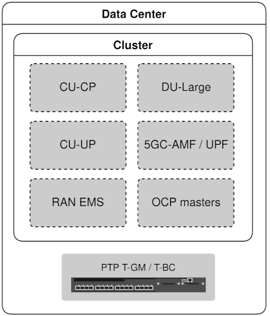

# __5G RAN reference structure__

# Overview
This folder contains the manifests for deploying the 5G RAN components on Kubernetes clusters. It complements the [`cn-ran-overlays`](../cn-ran-overlays), that defines a single DU profile, by addressing the manifests scalability aspects. The structure defined here can be extended beyond separate units, approaching closer to the structure maintained by a "typical" mobile network operator.
This folder also should become a single source of truth for RAN configurations deployed with Advanced Cluster Management for Kubernetes or additional orchestration tools.

## Goals
- Define typical RAN building blocks
- Define configuration overlay structure that will
    - Represents complex hierarchy of sites and clusters
    - Represent typical deployment patterns
        - Data center clusters
        - Single node
        - Remote worker node
        - 3-node cluster
    - Provide segregation between common and specific parts of the configuration, to minimize duplication

## Non-goals
- This structure only concerns Kubernetes cluster configuration for a "typical" RAN cloud native functions implemented under certain set of assumptions. There is no attempt to cover all different CNF types and all possible differences between them
- There is no attempt to evaluate repository organization approaches (i.e.monorepo vs. multi-repo). The approach might be different for every particular mobile network operator. This project contains both profiles and clusters definitions in a single repository, but this can be changed by replacing the direct links with links to other Git repositories.
- All non-virtualized physical network functions (switches, PTP equipment and radio equipment) are out of scope
- Zero-touch provisioning
- Orchestration procedures
- Advanced cluster management

## RAN introduction
The 5G RAN in the broader context is shown below:

*Source: 3GPP TS 23.501-g60*

RAN external interfaces (N2 and N3) carry control plane and user plane data respectively. They compose RAN backhaul networks. RAN backhaul may also aggregate one or more management networks, while the separation between all the networks is often realized through VLAN tagging.
N1 interface is transparent to RAN (encapsulated in N2).

Radio access network is divided to Centralized units (CU), distributed units (DU) and Radio units (RU). Centralized units are split to control plane and user plane functions (CU-CP and cu-up respectively).
RAN entities and internal interfaces from the telecommunications standard perspective are shown below:

From the high level blocks composing RAN (CU, DU, RU), only CU and DU can be virtualized and implemented as cloud-native functions.
CU / DU split is driven mostly by latency and traffic volume optimizations. 
A DU can be seen as an application performing intensive digital signal processing, data transfer and algorithmic tasks in constrained time budgets. DU implementations often use hardware acceleration (FPGA, GPU, eASIC) for DSP processing offload. There are also software-only implementations (FlexRAN), based on AVX-512 instructions. 

# Building blocks
## Deployment types
### Data centers
One of the desired effects of RAN transition to the Cloud is the ability to centralize its functions in data centers, utilizing standard IT infrastructure to provide pools of centralized RAN functions. 
A data center deployment will typically contain one or more Kubernetes clusters hosting various types of mobile network workloads:
- A pool of RAN CU-CP and / or cu-up units
- A pool of DU
- Functions related to 5G core network
- Management functions
It is important to emphasize that any of the functions above are optional and totally depend on the mobile network operator preferences and requirements. The servers running the above workloads are assumed to have two CPU sockets.

### Single-node clusters
Single node clusters are deployed at the far edge in cases when there is a need to deploy a small number of cells that can be catered by a single server. This deployment type can be realized as either remote worker node of an existing cluster, or a single node cluster (e.g. Single Node Openshift). In both cases the deployment is assumed to contain a minimum of one single-socket server. From the workload perspective only RAN DUs seem to be relevant for this deployment type at the moment.

### Three-node clusters
Three-node clusters are deployments where minimum three physical servers are used as both infrastructure nodes and worker nodes. Additional worker nodes can be configured if needed.
This type of deployment is expected to run on the Far Edge in cases where single node deployment is not sufficient. The workloads can vary from a small DU pool, to a full RAN and core network setup, oriented to local MNO data centers or private network deployments.

## Assumptions on RAN CNF requirements
### cu-up networks

### DU networks

# The manifest structure
The manifests defined here assume Kustomize as the tool of choice for Kubernetes cluster configuration. The structure defined here attempts to satisfy following requirements and assumptions:
- Segregation between the common template and the specific configuration of the particular cluster instance.
    - This is derived from the assumption that many clusters will use the same hardware configuration, and only differ by a small amount of network settings.
- Reuse of components and duplication avoidance
    - We want to avoid the duplication of the same code fragment in different places around the product. However, this sometimes comes at a price of making the code structure less intuitive for understanding. This is especially true when using configuration overlays.
- Usability /scalability considerations
    - Assuming that production deployments may have thousands of nodes organized in hundreds of clusters, we want the structure to facilitate the following use cases:
        - Create a new cluster based on an existing template
        - Compare two clusters
        - Add a new role (in addition to CU and DU)
        - Add a new hardware profile

## Folder hierarchy

### __operators__
The [operators](./operators) folder contains links to the operator deployments in the project' [`deploy`](../deploy) folder. 

TODO: Currently only ptp and sr-iov operators are defined here. Add local storage operator

### __profile-base__
The [profile-base](./profile-base) folder contains manifests that can be reused during cluster configuration by using the appropriate overlay transformers (more about this later).
The [profile-base](./profile-base) is divided to the several parts based on their commonality. The content is described in detail in [profile-base README](./profile-base/README.md)

### __clusters__
The [clusters](./clusters) folder contains the actual network tree of the cluster configurations. This is the only directory that is expected to be modified by partners for deployment or maintenance.
#### On clusters and sites
The scope of this work is limited to Kubernetes cluster configuration, so clusters are the main building blocks of this network model. However, a notion of sites can be also important to mobile network operators.

The relation between clusters and sites can be complicated. There are large sites, such as data centers, that can accommodate several clusters. At the same time there could be clusters spanning over several physical sites with remote worker nodes, or geo-diverse deployments. 
A cluster may serve one or more cell towers/locations/physical sites depending on a carrier's deployment model. Cluster naming is entirely under the control of the carrier but will be used by Zero Touch Provisioning to correlate the cluster to the configuration defined within this repository.
Remote worker node configurations can be optionally placed under the "remote-sites" subdirectory to logically separate between different sites belonging to the same cluster. In any case, application of a particular configuration to a particular cluster is expected to be handled by tools external to Kubernetes, on the upper orchestration level.

#### Configuration overlays
The cluster directory contains cluster-specific adjustments of the role-hardware basic profiles. The adjustments are most frequently required for node selectors, namespaces, network configurations, but can also include low scale adjustments of other hardware parameters.

# Examples 
## Data center DU customizations
[Data center DU pool](./clusters/otwaon1234rd/du-dual-m1)
## DU on a remote worker node
[DU on a remote worker node](./clusters/otwaon1234rd/remote-sites/otwaon23456rw)
## DU on a single node cluster
[DU on a single-node cluster](./clusters/otwaon34567sno)
## CU customizations
[Data center cu-up](./clusters/otwaon1234rd/cu-up)

TODO: Add 3NC

# Notes/Constraints/Caveats
The manifest structure provided here makes an attempt to build a hierarchical overlay structure aiming to simplify configuration and minimize duplication by use of overlays. However, the amount of text edits required from the administrator to create a replica of an existing cluster (configuration overhead) is still significant relatively to the amount of differences between the replica and the origin. The reason lies in the  Kustomize limitations, or lack of formatting compatibility with the API expectations. For example:
- There is no way to mutate node selectors in all instances of a certain resource kind
- ValueAddTransformer supports only "/" as path separator, so it can't be used (for example) to transform `resourceName` in `SriovNetwork` resource, or node selectors. This leads to excessive copying of all the above resources and mutating them one by one using `patches` transformer.

# Future development
There are ways forward to further reduce the configuration overhead required from MNO cluster administrators. The options include:
- Developing a plugin to Kustomize for each of the limitations listed above.
- Developing RAN profile API and exposing it through an operator, that will configure all the underlying operators behind the scenes.

# Additional documents
[Basic profile README.md](./profile-base/README.md)

[Single node cluster tuning](./profile-base/sno-general/README.md)

# Abbreviations in resource naming
There are several abbreviations used all over the manifests to bring the object or file names to a readable length:
| Short name | Definition |
| --- | --- |
| nnp | Network Node Policy |
| nw | Network |
| cu | Central Unit |
| du | Distributed unit |
| up | User plane |
| cp | Control plane |
| fh | Fronthaul |
| bh | Backhaul |
| mh | Midhaul |
| mh-c / bh-c | Midhaul / Backhaul control plane |
| mh-u / bh-u | Midhaul / Backhaul user plane |
| n0 / n1 | NUMA 0 / NUMA 1 |

