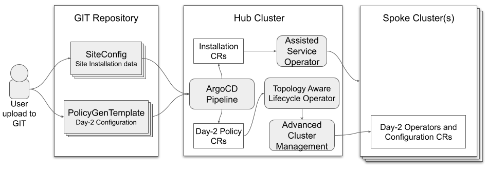

# GitOps ZTP pipeline

## Installing the GitOps Zero Touch Provisioning pipeline

### Preparation of ZTP GIT repository
Create a GIT repository for hosting site configuration data. The ZTP pipeline will require read access to this repository.
1. Create a directory structure with separate paths for SiteConfig and PolicyGenTemplate CRs
1. Add pre-sync.yaml and post-sync.yaml from resource-hook-example/*policygentemplates*/ to the path for PolicyGenTemplate CRs
1. Add pre-sync.yaml and post-sync.yaml from resource-hook-example/*siteconfig*/ to the path for SiteConfg CRs
    > If your hub cluster operates in a disconnected environment you must update the `image` all four pre/post sync hook CRs.

### Preparation of Hub cluster for ZTP
These steps configure your hub cluster with a set of ArgoCD Applications which generate the required installation and policy CRs for each site based on a ZTP gitops flow.
1. Install the Red Hat OpenShift GitOps operator on your hub cluster
1. Extract the administrator password for ArgoCD `oc get secret openshift-gitops-cluster -n openshift-gitops -o jsonpath='{.data.admin\.password}' | base64 -d`
1. Prepare the ArgoCD pipeline configuration
    1. Clone this repository
    1. Modify the `source` values of the two ArgoCD Applications (deployment/clusters-app.yaml and deployment/policies-app.yaml) with appropriate URL, targetRevision (branch), and path values. The path values must match those used in your GIT repository.
1. Apply pipeline configuration to your *hub* cluster. `oc apply -k ./deployment`

### Deploying a site
The following steps prepare the hub cluster for site deployement and initiate ZTP by pushing CRs to your GIT repository.
1. Add required secrets for site to the hub cluster. These resources must be in a namespace with a name matching the cluster name.
    1. Create secret for authenticating to the site BMC. Ensure the secret name matches the name used in the SiteConfig. In the example SiteConfig this is named `test-sno-bmh-secret`.
    1. Create pull secret for site. The pull secret must contain all credentials necessary for installing OpenShift and all day-2 operators. In the example SiteConfig this is named `assisted-deployment-pull-secret`
1. Add the SiteConfig CR for your site to your git repository
1. Add the PolicyGenTemplate CR for your site to your git repository
1. Push your changes to the git repository. The SiteConfig and PolicyGenTemplate CRs may be pushed similtaneously.

### Monitoring progress
The ArgoCD pipeline will detect the SiteConfig and PolicyGenTemplate CRs in GIT and sync them to the hub cluster. In the process it will generate installation and day-2 CRs and apply them to the hub. The progress of this synchronization can be monitored in the ArogCD dashboard.

The progress of cluster installation can be monitored from the commandline:  
`export CLUSTER=<clusterName>`  
`oc get agentclusterinstall -n $CLUSTER $CLUSTER -o jsonpath='{.status.conditions[?(@.type=="Completed")]}' | jq`  
`curl -sk $(oc get agentclusterinstall -n $CLUSTER $CLUSTER -o jsonpath='{.status.debugInfo.eventsURL}')  | jq '.[-2,-1]'`

The progress of day-2 policy reconciliation can be monitored in the ACM dashboard.

### Site Cleanup
To remove a site and the associated installation and day-2 policy CRs the SiteConfig and site-specific PolicyGenTemplate CR should be removed from the GIT repository. The pipeline hooks will remove the generated CRs.
**NOTE: Before removing a SiteConfig CR you must detach the cluster from ACM**

### Pipeline Teardown
If you need to remove the ArgoCD pipeline and all generated artifacts follow this procedure
1. Detach all clusters from ACM
1. Delete all SiteConfig and PolicyGenTemplate CRs from GIT
1. Delete the following namespaces
    1. All policy namespaces (oc get policy -A)
    1. clusters-sub
    1. policies-sub
1. oc delete -k cnf-features-deploy/ztp/gitops-subscriptions/argocd/deployment

## Troubleshooting GitOps ZTP
As noted above the ArgoCD pipeline synchronizes the SiteConfig and PolicyGenTemplate CRs from GIT to the hub cluster. In the process of doing so post-sync hooks create the installation and day-2 policy CRs which are also applied to the hub cluster. The following steps can be used to troubleshoot issues that may occur in this process.

### Validate generation of installation CRs
The installation CRs are applied to the hub cluster in a namespace with name matching the site name.  
`oc get AgentClusterInstall -n <clusterName>`
If no object is returned, troubleshoot the ArgoCD pipeline flow from SiteConfig to installation CRs.

1. Did the siteconfig get syncronized to the hub cluster?  
    `oc get siteconfig -A` or `oc get siteconfig -n clusters-sub`  
    If the SiteConfig is missing either:
    1. The `clusters` application failed to synchronize the CR from GIT to the hub. `oc describe -n openshift-gitops application clusters `
        1. Check for `Status: Synced` and that the Revision: is the SHA of the commit you pushed to the subscribed repository.
    1. The pre-sync hook failed, perhaps due to failure to pull the container image. Check the ArgoCD dashboard for status of the pre-sync Job under the `clusters` application.

1. Did the post hook job run?  
    `oc describe job -n clusters-sub siteconfig-post`
    1. Should indicate `succeeded: 1`
    1. Note that if the job fails Argo will retry it. In some cases the first pass will fail and the second pass will do nothing but show pass

1. Are there errors in the post hook job?  
    `oc get pod -n clusters-sub` Note the name of the siteconfig-post-xxxxx pod  
    `oc logs -n clusters-sub siteconfig-post-xxxxx`  
    Do the logs indicate errors in the generation of CRs?

### Validate generation of policy (day-2) CRs
Policy CRs are generated in same namespace as the PolicyGenTemplate from which they were created. This same troubleshooting flow applies to all policy CRs generated from PolicyGenTemplates regardless of whether they are common, group or site based.  
`export NS=<namespace>`  
`oc get policy -n $NS`  
The expected set of policy wrapped CRs should be displayed.

1. Did the PolicyGenTemplate get syncronized to the hub cluster?  
`oc get policygentemplate -A` or  `oc get policygentemplate -n $NS`  
If the PolicyGenTemplate is not synchronized follow the steps above for failure to synchronize the SiteConfig CR to the hub.

1. Did the policies get copied to the cluster namespace?
When ACM recognizes that policies apply to a ManagedCluster, the policy CR objects are applied to the cluster namespace:  
`oc get policy -n <clusterName>`  
All applicable policies should be copied here by ACM (ie should show common, group and site policies). The policy names are `<policyNamespace>.<policyName>`

1. For any policies not copied to the cluster namespace check the placement rule.
The matchSelector in the PlacementRule for those policies should match labels on the ManagedCluster.  
`oc get placementrule -n $NS` Make note of the PlacementRule name appropriate for the missing policy (eg common, group or site)  
`oc get placementrule -n $NS <placmentRuleName> -o yaml`  
    1. The status/decisions should include your cluster name
    1. The key/value of the matchSelector in the spec should match the labels on your managed cluster.
Check labels on MangedCluster:  
`oc get ManagedCluster $CLUSTER -o jsonpath='{.metadata.labels}' | jq`

1. Are some policies compliant and others not
`oc get policy -n $CLUSTER`  
If the Namespace, OperatorGroup, and Subscription policies are compliant but the operator configuration policies are not it is likely that the operators did not install on the spoke cluster. This causes the operator config policies to fail to apply because the CRD is not yet applied to spoke.
