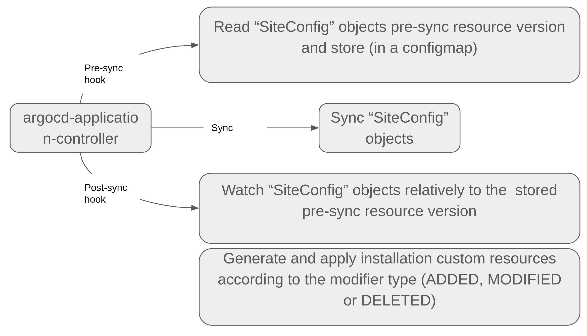

# README #

This directory provides RAN site ArgoCD gitops pipeline container image definitions

## What is this repository for? ##
### Quick summary ###

The idea is to accept RAN site manifests in a format defined by "SiteConfig" CRD, convert them to custom resources accepted by the assisted service and ACM, and apply them to the cluster running Assisted Service Operator and ACM hub.
The realization is using [ArgoCD resource hooks](https://argoproj.github.io/argo-cd/user-guide/resource_hooks/)

The pipeline would look like that:
1. ArgoCD monitors site-plan repo for new site-plan data. The site plan data is expressed as a custom resource.
2. Upon site plan change / push, ArgoCD synchronizes the site-plan data to the cluster. ArgoCD pre-sync and post-sync resource hooks are used to isolate the site configuration changes, convert them to changes in Assisted Service Operator and ACM resources and apply to the cluster.
The flow is shown below:



## How do I get set up? ##
### Prerequisites ###
1. You need an Openshift cluster (version 4.8 or above)
2. Red Hat GitOps operator installed
3. Red Hat Advanced cluster Management for Kubernetes installed (version 2.3 or above)
4. If you intend to build images yourself:
   1. To push images you build, you need [quay.io](quay.io) credentials and belonging to [Red Hat employees organization in quay](https://quay.io/organization/redhat_emp1). But you can always fork this repo and push to your private account or another registry if desired  (Change the `REG ?= quay.io/redhat_emp1/ztp-site-generator` line in the [Makefile](Makefile) to the container registry of your choice, and update [post-sync.yaml](../gitops-subscriptions/argocd/resource-hook-example/post-sync.yaml) and [pre-sync.yaml](../gitops-subscriptions/argocd/resource-hook-example/pre-sync.yaml) to point to the correct image)
   2. podman installed
   3. make installed

### Project organization ###
#### [resource-hooks](../gitops-subscriptions/argocd/resource-hook-example) ####
The [resource-hooks](../gitops-subscriptions/argocd/resource-hook-example) directory contains an example content of a site configuration repository that we want to define in the ArgoCD application to synchronize with our hub cluster.
- [test-sno.yaml](../gitops-subscriptions/argocd/resource-hook-example/test-sno.yaml) - site definitions. Please note, this file must be replicated for each new site a customer wants to create.
- [pre-sync.yaml](../gitops-subscriptions/argocd/resource-hook-example/pre-sync.yaml) and [post-sync.yaml](../gitops-subscriptions/argocd/resource-hook-example/post-sync.yaml) - resource hook definitions
- [kustomization.yaml](../gitops-subscriptions/argocd/resource-hook-example/kustomization.yaml) - Kustomize maifest linking all the above together

#### [deployment](../gitops-subscriptions/argocd/deployment) ####
[deployment](../gitops-subscriptions/argocd/deployment) directory contains manifests necessary for the application of Day 1 and Day 2 configurations.The manifests relevant for ArgoCD resource hooks are:
- [resource-hook-cluster-role](../gitops-subscriptions/argocd/deployment/resource-hook-cluster-role.yaml) - cluster role allowing ArgCD resource hooks to perform actions on SiteConfig and derived objects
- [resource-hook-role-binding](../gitops-subscriptions/argocd/deployment/resource-hook-role-binding.yaml) - role binding that assigns the above cluster role to the default service account in the `sites-sub` namespace (the one ArgoCD resource hooks are deployed to)
- [argocd-controller-role-binding](../gitops-subscriptions/argocd/deployment/gitops-cluster-rolebinding.yaml) - role binding that allows ArgoCD application controller to operate as a cluster admin
- [kustomization](../gitops-subscriptions/argocd/deployment/kustomization.yaml) - the Kustomize manifest linking the above together, and in addition applying the site configuration CRD (linked from a top level location)

#### [src](src) ####
This directory contains the resource hook scripts source code.

### Build ###
There are several Makefile targets that help to build and push the resource hook container image.
Type 
```bash
make help
```
to see the targets:

```bash
Usage:
  make <target>

General
  help             Display this help.

Build image
  build            Build container image

Make and push
  push             Push to Quay.io.

Cluster configuration deployment
  deploy           Deploy RBAC manifests and RAN Site CRD.
  undeploy         Undeploy RBAC manifests and RAN Site CRD.
```

### Example setup ###
1. In a terminal, clone this repo and change the working derectory to the cloned one
2. Login to your cluster
3. Create a git repository you want ArgoCD to monitor for site configuration and push the contents of the [resource-hooks](resource-hooks) directory there.
4. Run 
   ```bash
   oc apply -k deployment
   ```
5. In your cluster console, go to "Red Hat Applications" in the upper right corner (a button that looks like a table) and open `Cluster Argo CD`. Login using `admin` and password you get by running 
    ```bash
    oc get secret openshift-gitops-cluster -n openshift-gitops -o jsonpath='{.data.admin\.password}' | base64 -d
    ```
6. In the Argo CD web console go to `Projects` and change the propereties of the default project as follows:
   1. In the `namespace resource allow list ` add permission to modify the relevant namespaces It should be at lease `sites-sub` and all the deerived cluster namespaces. Since it is unreasonable to modify the project every time you add a new site, just allow everything (`*`).
   2. Save
7. Create ArgoCD application and link it to the repository you created on step 3
8. Create all the prerequisites defined [here](../ran-site-plan-crd/README.md)
9. All set, press "Sync" 