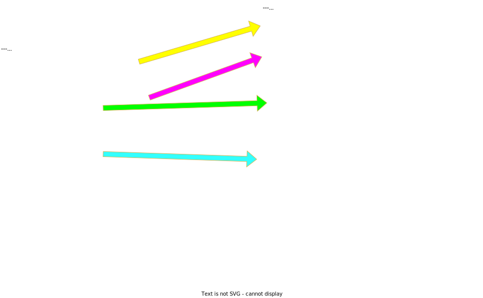

# PGT2ACMPG translation tool

The goal of the pgt2acmpg tool is to ease the conversion between
[Policy Generator Templates](https://github.com/openshift-kni/cnf-features-deploy/tree/master/ztp/policygenerator) (or PGT)
and
[ACMPG Templates](https://github.com/open-cluster-management-io/policy-generator-plugin) (or ACMPG)

## Usage

``` default
Usage of ./pgt2acmpg:
  -c string
        the optional comma delimited list of reference source CRs templates
  -g    optionally generates ACM policies for PGT and ACMPG templates
  -i string
        the PGT input file
  -k string
        the optional list of manifest kinds for which to pre-render patches
  -n string
        the optional ns.yaml file path (default "ns.yaml")
  -o string
        the ACMPG output Directory
  -s string
        the optional schema for all non base CRDs
```

The -g option also requires `PolicyGenerator` and `PolicyGenTemplate`
executables in the proper subdirectory as specified by Kustomize plugin API. The
kustomize subdirectory of this project provides both executable in the correct
relative path. To use them, use the following kustomize environment variable
when running pgt2acmpg:

``` default
KUSTOMIZE_PLUGIN_HOME=$(pwd)/kustomize 
```

so for instance, an example to generate policies for PGT and ACMPG would be:

``` default
 KUSTOMIZE_PLUGIN_HOME=$(pwd)/../../pgt2acmpg/kustomize pgt2acmpg -i
 mydir/policygentemplates -o mydir/acmpg -s
 /tmp/newptpconfig-schema.json -k PtpConfig -c /tmp/source-crs

```

## Running from official ztp container

The pgt2acmpg executable is also part of the official ZTP container. To run the pgt2acmpg tool run the following podmand command:

```
podman run \
--user root:root \
-e KUSTOMIZE_PLUGIN_HOME=/kustomize-pgt2acmpg \
-v $(pwd)/output:/home/ztp:Z \
-v $(pwd)/PolicyGenerator:/kustomize-pgt2acmpg/policy.open-cluster-management.io/PolicyGenerator:Z \
-v $(pwd)/policygentemplates:/policygentemplates:Z \
-v $(pwd)/acmpg:/acmpg:Z \
quay.io/openshift-kni/ztp-site-generator:latest \
pgt2acmpg \
-i /policygentemplates \
-o /acmpg  \
-c /policygentemplates/source-crs \
-g
```

`--user root:root` : overwrides the default container UID  
`-e KUSTOMIZE_PLUGIN_HOME=/kustomize-pgt2acmpg`: environment variable indicating the location of the kustomize plugins  
`-v $(pwd)/output:/home/ztp:Z`: the output directoy to retrieve the acmpg-out.yaml and pgt-out.yaml generated ACM policies
`-v $(pwd)/PolicyGenerator:/kustomize-pgt2acmpg/policy.open-cluster-management.io/v1/policygenerator/PolicyGenerator:Z`: mount the PolicyGenerator plugin executable see [Getting the PolicyGennerator executable](#getting-the-policygennerator-executable) on how to download it.
`-v $(pwd)/policygentemplates:/policygentemplates:Z`: mount for input PGT directory  
`-v $(pwd)/acmpg:/acmpg:Z`: mount for output ACM Policy Gen directory  
`quay.io/openshift-kni/ztp-site-generator:latest`: Official ZTP image   
`pgt2acmpg`: pgt2acmpg executable  
`-i /policygentemplates`: PGT directory  
`-o /acmpg`: ACM Policy Gen directory  
`-c /policygentemplates/source-crs`: source CRs directory  
`-g`: option to render ACM policies for PGT and ACMPG  

### Getting the PolicyGennerator executable

Run the multicluster-operators-subscription image with podman
```podman run --name test registry.redhat.io/rhacm2/multicluster-operators-subscription-rhel9:v2.10 ```

Ignore any erross coming from running the image. Copy the PolicyGenerator image in current directory:
```podman cp test:/policy-generator/PolicyGenerator-not-fips-compliant PolicyGenerator```

## Example, converting PGT to ACMPG for GitOps

### Pre-requisites

This example assumes that the following is available:

- a working gitops repository. For instance, consider the following directory
  structure:

``` default
├── policygentemplates
│   ├── common-ranGen.yaml
│   ├── group-du-sno-ranGen.yaml
│   ├── group-du-sno-validator-ranGen.yaml
│   ├── helix59.yaml
│   ├── kustomization.yaml
│   ├── ns.yaml
│   └── source-crs
│       ├── just-a-test.yaml
│       └── PtpConfigSlaveCustom.yaml
└── siteconfig
    ├── helix59.yaml
    ├── kustomization.yaml
    └── sno-extra-manifest
        ├── 04-rh-internal-icsp.yaml
        ├── custom-mcp.yaml
        ├── enable_crun_master.yaml
        └── enable_crun_worker.yaml
```

- a source-crs directory. With PGT there is the option to not provide the
  reference source-crs used by the templates. In the example above, only 2
  source-crs are provided, but in fact many more are used by template. When
  rendering the template, argoCD would use copy the source-crs that it contains.

### Get a source-crs directory matching the template release

- Retrieve the source-crs directory corresponding the the version of the
  template, or alternatively upgrade the template to the latest version. This is
  an important step, since some source-crs files could be added or deleted
  across releases

### Verify the name of the resources patched by PGT templates

ACM template are patching resource file differently, using Kustomize and the
[Strategic Merge Patch](https://github.com/kubernetes/community/blob/master/contributors/devel/sig-api-machinery/strategic-merge-patch.md).
In a nutshell, Kustomize will extract the kind, name and namespace of the
resource patch defined in the PGT template. With this data, kustomize will
identify the correct resource in the source-crs file that is to be patched and
then apply the patch. If the resource in the patch declared by the template is
not found, pgt2acmpg displays a error similar to (PtpConfig resource with slave1
name and openshift-ptp was not found in source-crs):

``` default
Could not convert PGT files, err: failed to convert PGT to ACMPG, err=could not
render patches in manifest, err:failed to process the manifest at
"acmpg/source-crs/PtpConfigSlaveCustom-MCP-master.yaml": failed to
apply the patch(es) to the manifest(s) using Kustomize: no resource matches
strategic merge patch "PtpConfig.v1.ptp.openshift.io/slave1.openshift-ptp": no
matches for Id PtpConfig.v1.ptp.openshift.io/slave1.openshift-ptp; failed to
find unique target for patch PtpConfig.v1.ptp.openshift.io/slave1.openshift-ptp
```

If renaming of the resource is needed it should be done both in the template and
the source-crs directory

### Update PGT template patches to support Kustomize patching strategy

Some resource need additional patch configuration for Kustomize to work:

- extra directives are sometimes needed of the there is no schema available in
  k8s to describe a field. This is the case with the PtpConfig plugins field
  which can be set to any yaml file. In this case, we can only replace the
  content so a replace directive should be added (see
  [Strategic Merge Patch](https://github.com/kubernetes/community/blob/master/contributors/devel/sig-api-machinery/strategic-merge-patch.md)
  for details):

  ``` default
          $patch: replace 
          plugins:
            e810:
              enableDefaultConfig: false
              pins:
                "ens7f0":
                  "U.FL2": "0 2"
                  "U.FL1": "0 1"
                  "SMA2": "0 2"
                  "SMA1": "0 1"
  ```

### Optional: Create a Kustomize schema.json

This is useful if patching CRD resources containing list of objects (needed for
ptp-config). Retrieve a schema.json file including the Kustomize schema for all
the resources that contain lists that need to be patched intelligently.
Kustomize uses strategic merge to merge patches intelligently. In case of
complex CRD resources including lists, a schema is required so that Kustomize
understands what is the list key. For instance the key to a list of profile
could be the profile name. So the patch needs to use the name in the list to be
able to find the entry to patch. See more details
[here](https://kubectl.docs.kubernetes.io/references/kustomize/kustomization/openapi/)

To retrieve a schema from a running kubernetes cluster, do the following:

``` default
kustomize openapi fetch
```

Then cut and paste the sections with the resources that need to be patched. An
example of schema is at
[newptpconfig-schema.json](test/newptpconfig-schema.json).

Next, identify the list objects in the schema and select a key from the fields
of the object that would be use to index the list, for instance a name. After
the definition of the list, add the following text:

``` default
              "x-kubernetes-patch-merge-key": "name",
              "x-kubernetes-patch-strategy": "merge"
```

`x-kubernetes-patch-merge-key` indicates the field in the object that is used to
uniquely identify it in the list in this case the `name` field
`x-kubernetes-patch-strategy` indicates the patch strategy. Merge would merge
fields, replace would replace the object identified by the key with patch
content.

The -s option take a path to the schema file. The schema file can contain the
definition for multiple CRD resources. Also only CRD resources needs a schema
file. The schema definition for build-in Kubernetes resources is already part of
Kustomize.

The -k option must be use to apply the patches to source-crs resource files
using the schema file. The option specified the comma separated list of objects
that need to be patched using a schema (because they contains list of objects).
The resulting pre-rendered resource definition is inserted a patch in the ACM
template. Once ACM policy-generator-plugin supports specifying a schema (see
[ref.](https://github.com/open-cluster-management-io/policy-generator-plugin/issues/142)),
the -k option will no longer be needed.

### Running the conversion

Now that we have:

- prepared the PGT templates for conversion,
- extracted a schema for all resources that need it,
- located a reference source-crs directory corresponding to the PGT schema version

We can run the conversion by running the following command:

``` default
 KUSTOMIZE_PLUGIN_HOME=$(pwd)/../../pgt2acmpg/kustomize pgt2acmpg -i
 mydir/policygentemplates -o mydir/acmpg -s
 /tmp/newptpconfig-schema.json -k PtpConfig -c
 mydir/policygentemplates/source-crs,/tmp/source-crs
```

`KUSTOMIZE_PLUGIN_HOME=$(pwd)/../../pgt2acmpg-new/kustomize` : indicates the path
to a Kustomize plugin directory structure. For convenience, pecompiled binaries
and directories are provided with this project in the [kustomize](kustomize) subdirectory

`pgt2acmpg` : this is the pgt2acmpg executable

`-i mydir/policygentemplates` : the source PGT templates to be converted

`-o policygentemplates` : the destination ACMPG templates directory to be
created

`-s /tmp/newptpconfig-schema.json` : the Kustomize schema containing
definitions for all objects with list that need to be patched

`-k PtpConfig` :
the comma separated list of objects containing list that need to be patched

`-c mydir/policygentemplates/source-crs,/tmp/source-crs` : the directories
containing the source-crs corresponding to the template version. In this case
the PGT directory contains some custom templates, they are added as the first
path in the list of source-crs. The reference source-crs should be added last
(any order will work, but will produce spurious "skipping" logs)

A successful conversion output looks like:

``` default
Copied source-cr at
/home/deliedit/dev/tpmv2/ztp/cnf-features-deploy/ztp/source-crs successfully
Wrote converted ACM template: policygentemplates/source-crs/DefaultCatsrc.yaml
Wrote converted ACM template:
policygentemplates/source-crs/ReduceMonitoringFootprint.yaml Wrote converted ACM
template: policygentemplates/source-crs/DefaultCatsrc.yaml Wrote converted ACM
template: policygentemplates/source-crs/DefaultCatsrc.yaml Wrote converted ACM
template: policygentemplates/source-crs/ReduceMonitoringFootprint.yaml Wrote
converted ACM template: policygentemplates/source-crs/DefaultCatsrc.yaml Wrote
converted ACM template: policygentemplates/source-crs/SriovSubscription.yaml
Wrote converted ACM template:
policygentemplates/source-crs/SriovSubscriptionNS.yaml Wrote converted ACM
template: policygentemplates/source-crs/SriovSubscriptionOperGroup.yaml Wrote
converted ACM template: policygentemplates/source-crs/SriovOperatorStatus.yaml
Wrote converted ACM template: policygentemplates/source-crs/PtpSubscription.yaml
Wrote converted ACM template:
policygentemplates/source-crs/PtpSubscriptionNS.yaml Wrote converted ACM
template: policygentemplates/source-crs/PtpSubscriptionOperGroup.yaml Wrote
converted ACM template: policygentemplates/source-crs/PtpOperatorStatus.yaml
Wrote converted ACM template: policygentemplates/source-crs/ClusterLogNS.yaml
Wrote converted ACM template:
policygentemplates/source-crs/ClusterLogOperGroup.yaml Wrote converted ACM
template: policygentemplates/source-crs/ClusterLogSubscription.yaml Wrote
converted ACM template:
policygentemplates/source-crs/ClusterLogOperatorStatus.yaml Wrote converted ACM
template: policygentemplates/source-crs/StorageNS.yaml Wrote converted ACM
template: policygentemplates/source-crs/StorageOperGroup.yaml Wrote converted
ACM template: policygentemplates/source-crs/StorageSubscription.yaml Wrote
converted ACM template: policygentemplates/source-crs/StorageOperatorStatus.yaml
Wrote converted ACM template: policygentemplates/source-crs/AcceleratorsNS.yaml
Wrote converted ACM template:
policygentemplates/source-crs/AcceleratorsOperGroup.yaml Wrote converted ACM
template: policygentemplates/source-crs/AcceleratorsSubscription.yaml Wrote
converted ACM template:
policygentemplates/source-crs/BareMetalEventRelaySubscription.yaml Wrote
converted ACM template:
policygentemplates/source-crs/BareMetalEventRelaySubscriptionNS.yaml Wrote
converted ACM template:
policygentemplates/source-crs/BareMetalEventRelaySubscriptionOperGroup.yaml
Wrote converted ACM template: policygentemplates/acm-common-ranGen.yaml Wrote
converted ACM template: policygentemplates/source-crs/ClusterLogForwarder.yaml
Wrote converted ACM template: policygentemplates/source-crs/ClusterLogging.yaml
Wrote converted ACM template: policygentemplates/source-crs/DisableOLMPprof.yaml
Wrote converted ACM template:
policygentemplates/source-crs/PtpOperatorConfigForEvent-MCP-master.yaml Wrote
converted ACM template:
policygentemplates/source-crs/PtpConfigGmWpc-MCP-master.yaml Wrote converted ACM
template: policygentemplates/source-crs/PtpConfigSlaveCustom-MCP-master.yaml
Wrote converted ACM template:
policygentemplates/source-crs/SriovOperatorConfig-MCP-master.yaml Wrote
converted ACM template: policygentemplates/source-crs/DisableSnoNetworkDiag.yaml
Wrote converted ACM template: policygentemplates/source-crs/HardwareEvent.yaml
Wrote converted ACM template:
policygentemplates/source-crs/PerformanceProfile-MCP-master.yaml Wrote converted
ACM template:
policygentemplates/source-crs/TunedPerformancePatch-MCP-master.yaml Wrote
converted ACM template: policygentemplates/source-crs/MachineConfigGeneric.yaml
Wrote converted ACM template: policygentemplates/source-crs/StorageLV.yaml Wrote
converted ACM template: policygentemplates/acm-group-du-sno-ranGen.yaml Wrote
converted ACM template:
policygentemplates/source-crs/validatorCRs/informDuValidator-MCP-master.yaml
Wrote converted ACM template:
policygentemplates/acm-group-du-sno-validator-ranGen.yaml Wrote converted ACM
template: policygentemplates/source-crs/SriovNetwork.yaml Wrote converted ACM
template: policygentemplates/source-crs/SriovNetworkNodePolicy-MCP-master.yaml
Wrote converted ACM template: policygentemplates/source-crs/SriovNetwork.yaml
Wrote converted ACM template:
policygentemplates/source-crs/SriovNetworkNodePolicy-MCP-master.yaml Wrote
converted ACM template:
policygentemplates/source-crs/SriovNetworkNodePolicy-MCP-master.yaml Wrote
converted ACM template: policygentemplates/acm-helix59.yaml Wrote Kustomization
resource: policygentemplates/ns.yaml Wrote Updated Kustomization file:
policygentemplates/kustomization.yaml Added default placement binding
to:policygentemplates/ns.yaml
```

The new directory structure now looks like:

``` default
.
├── acmpg
│   ├── acm-common-ranGen.yaml
│   └── source-crs
│       ├── AcceleratorsNS.yaml
│       ├── AcceleratorsOperatorStatus.yaml
│       ├── AcceleratorsOperGroup.yaml
│       ├── AcceleratorsSubscription.yaml
│       ├── AmqInstance.yaml
│       ├── AmqOperatorStatus.yaml
│       ├── AmqSubscriptionNS.yaml
│       ├── AmqSubscriptionOperGroup.yaml
│       ├── AmqSubscription.yaml
│       ├── BareMetalEventRelaySubscriptionNS.yaml
│       ├── BareMetalEventRelaySubscriptionOperGroup.yaml
│       ├── BareMetalEventRelaySubscription.yaml
│       ├── ClusterLogCatSource.yaml
│       ├── ClusterLogForwarder.yaml
│       ├── ClusterLogging.yaml
│       ├── ClusterLogNS.yaml
│       ├── ClusterLogOperatorStatus.yaml
│       ├── ClusterLogOperGroup.yaml
│       ├── ClusterLogSubscription.yaml
│       ├── ClusterVersion.yaml
│       ├── ConsoleOperatorDisable.yaml
│       ├── DefaultCatsrc.yaml
│       ├── DisableOLMPprof.yaml
│       ├── DisableSnoNetworkDiag.yaml
│       ├── DisconnectedICSP.yaml
│       ├── extra-manifest
│       │   ├── 01-container-mount-ns-and-kubelet-conf-master.yaml
│       │   ├── 01-container-mount-ns-and-kubelet-conf-worker.yaml
│       │   ├── 03-sctp-machine-config-master.yaml
│       │   ├── 03-sctp-machine-config-worker.yaml
│       │   ├── 05-kdump-config-master.yaml
│       │   ├── 05-kdump-config-worker.yaml
│       │   ├── 06-kdump-master.yaml
│       │   ├── 06-kdump-worker.yaml
│       │   ├── 07-sriov-related-kernel-args-master.yaml
│       │   ├── 07-sriov-related-kernel-args-worker.yaml
│       │   ├── 08-set-rcu-normal-master.yaml
│       │   ├── 08-set-rcu-normal-worker.yaml
│       │   ├── 09-openshift-marketplace-ns.yaml
│       │   ├── 99-crio-disable-wipe-master.yaml
│       │   ├── 99-crio-disable-wipe-worker.yaml
│       │   ├── 99-sync-time-once-master.yaml
│       │   ├── 99-sync-time-once-worker.yaml
│       │   ├── disk-encryption.yaml.tmpl
│       │   ├── enable-cgroups-v1.yaml
│       │   ├── image-registry-partition-mc.yaml.tmpl
│       │   └── workload
│       │       ├── 03-workload-partitioning.yaml
│       │       ├── crio.conf
│       │       └── kubelet.conf
│       ├── HardwareEvent.yaml
│       ├── ImageBasedUpgrade.yaml
│       ├── ImageRegistryConfig.yaml
│       ├── ImageRegistryPV.yaml
│       ├── ImageSignature.yaml
│       ├── just-a-test.yaml
│       ├── LVMOperatorStatus.yaml
│       ├── MachineConfigContainerMountNS.yaml
│       ├── MachineConfigGeneric.yaml
│       ├── MachineConfigPool.yaml
│       ├── MachineConfigSctp.yaml
│       ├── optional-extra-manifest
│       │   ├── enable-crun-master.yaml
│       │   └── enable-crun-worker.yaml
│       ├── PaoOperatorStatus.yaml
│       ├── PaoSubscriptionCatalogSource.yaml
│       ├── PaoSubscriptionNS.yaml
│       ├── PaoSubscriptionOperGroup.yaml
│       ├── PaoSubscription.yaml
│       ├── PerformanceProfile-SetSelector.yaml
│       ├── PerformanceProfile.yaml
│       ├── PtpCatSource.yaml
│       ├── PtpConfigBoundary.yaml
│       ├── PtpConfigDualCardGmWpc.yaml
│       ├── PtpConfigGmWpc-MCP-master.yaml
│       ├── PtpConfigGmWpc.yaml
│       ├── PtpConfigMaster.yaml
│       ├── PtpConfigSlaveCustom-MCP-master.yaml
│       ├── PtpConfigSlaveCustom.yaml
│       ├── PtpConfigSlaveCvl.yaml
│       ├── PtpConfigSlave.yaml
│       ├── PtpOperatorConfigForEvent-MCP-master.yaml
│       ├── PtpOperatorConfigForEvent-SetSelector.yaml
│       ├── PtpOperatorConfigForEvent.yaml
│       ├── PtpOperatorConfig-SetSelector.yaml
│       ├── PtpOperatorConfig.yaml
│       ├── PtpOperatorStatus.yaml
│       ├── PtpSubscriptionNS.yaml
│       ├── PtpSubscriptionOperGroup.yaml
│       ├── PtpSubscription.yaml
│       ├── README.md
│       ├── ReduceMonitoringFootprint.yaml
│       ├── SriovCatSource.yaml
│       ├── SriovFecClusterConfig.yaml
│       ├── SriovNetworkNodePolicy-SetSelector.yaml
│       ├── SriovNetworkNodePolicy.yaml
│       ├── SriovNetwork.yaml
│       ├── SriovOperatorConfig-SetSelector.yaml
│       ├── SriovOperatorConfig.yaml
│       ├── SriovOperatorStatus.yaml
│       ├── SriovSubscriptionNS.yaml
│       ├── SriovSubscriptionOperGroup.yaml
│       ├── SriovSubscription.yaml
│       ├── StorageCatSource.yaml
│       ├── StorageClass.yaml
│       ├── StorageLocalVolume.yaml
│       ├── StorageLVMCluster.yaml
│       ├── StorageLVMOSubscriptionNS.yaml
│       ├── StorageLVMOSubscriptionOperGroup.yaml
│       ├── StorageLVMOSubscription.yaml
│       ├── StorageLVMSubscriptionNS.yaml
│       ├── StorageLVMSubscriptionOperGroup.yaml
│       ├── StorageLVMSubscription.yaml
│       ├── StorageLV.yaml
│       ├── StorageNS.yaml
│       ├── StorageOperatorStatus.yaml
│       ├── StorageOperGroup.yaml
│       ├── StoragePVC.yaml
│       ├── StoragePV.yaml
│       ├── StorageSubscription.yaml
│       ├── TunedPerformancePatch.yaml
│       └── validatorCRs
│           ├── informDuValidatorMaster.yaml
│           ├── informDuValidatorWorker.yaml
│           └── informDuValidator.yaml
├── policygentemplates
│   ├── acm-common-ranGen.yaml
│   ├── acm-group-du-sno-ranGen.yaml
│   ├── acm-group-du-sno-validator-ranGen.yaml
│   ├── acm-helix59.yaml
│   ├── common-ranGen.yaml
│   ├── group-du-sno-ranGen.yaml
│   ├── group-du-sno-validator-ranGen.yaml
│   ├── helix59.yaml
│   ├── kustomization.yaml
│   ├── ns.yaml
│   └── source-crs
│       ├── AcceleratorsNS.yaml
│       ├── AcceleratorsOperatorStatus.yaml
│       ├── AcceleratorsOperGroup.yaml
│       ├── AcceleratorsSubscription.yaml
│       ├── AmqInstance.yaml
│       ├── AmqOperatorStatus.yaml
│       ├── AmqSubscriptionNS.yaml
│       ├── AmqSubscriptionOperGroup.yaml
│       ├── AmqSubscription.yaml
│       ├── BareMetalEventRelaySubscriptionNS.yaml
│       ├── BareMetalEventRelaySubscriptionOperGroup.yaml
│       ├── BareMetalEventRelaySubscription.yaml
│       ├── ClusterLogCatSource.yaml
│       ├── ClusterLogForwarder.yaml
│       ├── ClusterLogging.yaml
│       ├── ClusterLogNS.yaml
│       ├── ClusterLogOperatorStatus.yaml
│       ├── ClusterLogOperGroup.yaml
│       ├── ClusterLogSubscription.yaml
│       ├── ClusterVersion.yaml
│       ├── ConsoleOperatorDisable.yaml
│       ├── DefaultCatsrc.yaml
│       ├── DisableOLMPprof.yaml
│       ├── DisableSnoNetworkDiag.yaml
│       ├── DisconnectedICSP.yaml
│       ├── extra-manifest
│       │   ├── 01-container-mount-ns-and-kubelet-conf-master.yaml
│       │   ├── 01-container-mount-ns-and-kubelet-conf-worker.yaml
│       │   ├── 03-sctp-machine-config-master.yaml
│       │   ├── 03-sctp-machine-config-worker.yaml
│       │   ├── 05-kdump-config-master.yaml
│       │   ├── 05-kdump-config-worker.yaml
│       │   ├── 06-kdump-master.yaml
│       │   ├── 06-kdump-worker.yaml
│       │   ├── 07-sriov-related-kernel-args-master.yaml
│       │   ├── 07-sriov-related-kernel-args-worker.yaml
│       │   ├── 08-set-rcu-normal-master.yaml
│       │   ├── 08-set-rcu-normal-worker.yaml
│       │   ├── 09-openshift-marketplace-ns.yaml
│       │   ├── 99-crio-disable-wipe-master.yaml
│       │   ├── 99-crio-disable-wipe-worker.yaml
│       │   ├── 99-sync-time-once-master.yaml
│       │   ├── 99-sync-time-once-worker.yaml
│       │   ├── disk-encryption.yaml.tmpl
│       │   ├── enable-cgroups-v1.yaml
│       │   ├── image-registry-partition-mc.yaml.tmpl
│       │   └── workload
│       │       ├── 03-workload-partitioning.yaml
│       │       ├── crio.conf
│       │       └── kubelet.conf
│       ├── HardwareEvent.yaml
│       ├── ImageBasedUpgrade.yaml
│       ├── ImageRegistryConfig.yaml
│       ├── ImageRegistryPV.yaml
│       ├── ImageSignature.yaml
│       ├── just-a-test.yaml
│       ├── LVMOperatorStatus.yaml
│       ├── MachineConfigContainerMountNS.yaml
│       ├── MachineConfigGeneric.yaml
│       ├── MachineConfigPool.yaml
│       ├── MachineConfigSctp.yaml
│       ├── optional-extra-manifest
│       │   ├── enable-crun-master.yaml
│       │   └── enable-crun-worker.yaml
│       ├── PaoOperatorStatus.yaml
│       ├── PaoSubscriptionCatalogSource.yaml
│       ├── PaoSubscriptionNS.yaml
│       ├── PaoSubscriptionOperGroup.yaml
│       ├── PaoSubscription.yaml
│       ├── PerformanceProfile-MCP-master.yaml
│       ├── PerformanceProfile-SetSelector.yaml
│       ├── PerformanceProfile.yaml
│       ├── PtpCatSource.yaml
│       ├── PtpConfigBoundary.yaml
│       ├── PtpConfigDualCardGmWpc.yaml
│       ├── PtpConfigGmWpc-MCP-master.yaml
│       ├── PtpConfigGmWpc.yaml
│       ├── PtpConfigMaster.yaml
│       ├── PtpConfigSlaveCustom-MCP-master.yaml
│       ├── PtpConfigSlaveCustom.yaml
│       ├── PtpConfigSlaveCvl.yaml
│       ├── PtpConfigSlave.yaml
│       ├── PtpOperatorConfigForEvent-MCP-master.yaml
│       ├── PtpOperatorConfigForEvent-SetSelector.yaml
│       ├── PtpOperatorConfigForEvent.yaml
│       ├── PtpOperatorConfig-SetSelector.yaml
│       ├── PtpOperatorConfig.yaml
│       ├── PtpOperatorStatus.yaml
│       ├── PtpSubscriptionNS.yaml
│       ├── PtpSubscriptionOperGroup.yaml
│       ├── PtpSubscription.yaml
│       ├── README.md
│       ├── ReduceMonitoringFootprint.yaml
│       ├── SriovCatSource.yaml
│       ├── SriovFecClusterConfig.yaml
│       ├── SriovNetworkNodePolicy-MCP-master.yaml
│       ├── SriovNetworkNodePolicy-SetSelector.yaml
│       ├── SriovNetworkNodePolicy.yaml
│       ├── SriovNetwork.yaml
│       ├── SriovOperatorConfig-MCP-master.yaml
│       ├── SriovOperatorConfig-SetSelector.yaml
│       ├── SriovOperatorConfig.yaml
│       ├── SriovOperatorStatus.yaml
│       ├── SriovSubscriptionNS.yaml
│       ├── SriovSubscriptionOperGroup.yaml
│       ├── SriovSubscription.yaml
│       ├── StorageCatSource.yaml
│       ├── StorageClass.yaml
│       ├── StorageLocalVolume.yaml
│       ├── StorageLVMCluster.yaml
│       ├── StorageLVMOSubscriptionNS.yaml
│       ├── StorageLVMOSubscriptionOperGroup.yaml
│       ├── StorageLVMOSubscription.yaml
│       ├── StorageLVMSubscriptionNS.yaml
│       ├── StorageLVMSubscriptionOperGroup.yaml
│       ├── StorageLVMSubscription.yaml
│       ├── StorageLV.yaml
│       ├── StorageNS.yaml
│       ├── StorageOperatorStatus.yaml
│       ├── StorageOperGroup.yaml
│       ├── StoragePVC.yaml
│       ├── StoragePV.yaml
│       ├── StorageSubscription.yaml
│       ├── TunedPerformancePatch-MCP-master.yaml
│       ├── TunedPerformancePatch.yaml
│       └── validatorCRs
│           ├── informDuValidatorMaster.yaml
│           ├── informDuValidator-MCP-master.yaml
│           ├── informDuValidatorWorker.yaml
│           └── informDuValidator.yaml
└── siteconfig
    ├── helix59.yaml
    ├── kustomization.yaml
    └── sno-extra-manifest
        ├── 04-rh-internal-icsp.yaml
        ├── custom-mcp.yaml
        ├── enable_crun_master.yaml
        └── enable_crun_worker.yaml

```

### Finding conversions errors

To catch conversion errors early on, the -g option allow generating ACM policies
for both PGT and ACMPG templates. This option required a properly configured
Kustomize plugin home directory using the `KUSTOMIZE_PLUGIN_HOME` environment
variable.

A working directory including binaries for PGT and ACMPG templates is provided
with this project at [kustomize](kustomize). To use it set the environment
variable to:

``` default
KUSTOMIZE_PLUGIN_HOME=$(pwd)/kustomize 
```

After running the conversion, 2 files are generated in the same directory as
where pgt2acmpg ran:

- `pgt-out.yaml`: these are the policies generated by the old PGT templates
  using Kustomize RAN policygen plugin
- `acmpg-out.yaml`: these are the policies generated by the translated ACMPG
  templates using Kustomize ACM policy generator plugin

Use a comparison diff tool to compare the two. Most fields should match except
for placement API objects and PGT Template variable that are not expanded.

After fixing any remaining issues, the conversion is complete.

### Telling ArgoCD where to find the new ACM templates

By default the current template directory is named policygentemplates. The name
of the directory read by the ArgoCD app can be changed following the
instructions at
[Configuring the hub cluster with ArgoCD](https://docs.openshift.com/container-platform/4.14/scalability_and_performance/ztp_far_edge/ztp-preparing-the-hub-cluster.html#ztp-configuring-hub-cluster-with-argocd_ztp-preparing-the-hub-cluster).
See section
`Modify the two ArgoCD applications, out/argocd/deployment/clusters-app.yaml`

You can also just delete the old policygentemplates directory and then rename
the new acmpg deirectory to policygentemplates. ArgoCD would find the
new ACM templates the old directory.

## conversion mechanism

### Convert simple fields

The `apiVersion`, `kind`, `metadata->name`, `namespace`, and `binding rules` are
mapped as follow between the PGT and ACMPG templates



### Convert PGT policies to ACMPG policies


In PGT, the policies are listed under the sourceFiles field. To each file name
in the list is associated a single policy. The same policy can be mapped to
different file names

In ACMPG Templates, the policies are listed under the policies field. The
files implementing the policies are listed under the policies->manifests
section. See the converted ACMPG Template policy below. So in short in ACM
policies we have a list of policies with a list of manifests. In PGT we have a
list of source files that are tagged with a policy name,

The manifest name and path is changed as follows:

`PtpConfigSlave`.yaml --> source-crs/`PtpConfigSlave`-MCP-worker.yaml  

The policy wave is retrieved from the first manifest defined in the policy. All
manifest must have the same wave number

``` default
     policyAnnotations:
       ran.openshift.io/ztp-deploy-wave: "10"
```

`PolicyDefaults.RemediationAction` is set to inform

### Policy patches

PGT and ACMPG templates can apply patches to reference manifest using
Kustomize merge method. PGT can arbitrarily merge CRDs containing list of
objects but not ACMPG. See the following issue in the
[policy-generator-plugin](https://github.com/open-cluster-management-io/policy-generator-plugin)
project:
<https://github.com/open-cluster-management-io/policy-generator-plugin/issues/142>
As a workaround, pgt2acmpg supports passing a open API schema that allows
kustomizing CRDs that contain list of objects such as in PtpConfig. In addition
to the schema, pgt2acmpg also needs a list of CRD kinds that should be
pre-kustomized. Internally, pgt2acmpg will use the schema to Kustomize the
reference manifest with the patches contained in the policy. The resulting
"Kustomized" manifest is used to create a new patch that will render properly
when using
[policy-generator-plugin](https://github.com/open-cluster-management-io/policy-generator-plugin)
without an open API schema.

- Take this example of PGT for a PTP policy:  
  [policies-pgt.yaml](./docs/examples/policies-pgt.yaml)
- The same policy converted with prerendering of patches to ACMPG is:  
[policies-acmPGPreRender.yaml](./docs/examples/policies-acmPGPreRender.yaml)  
- If not using pre-rendering we en up with the following incorrect ACMPG
  Template since
  [policy-generator-plugin](https://github.com/open-cluster-management-io/policy-generator-plugin)
  cannot Kustomize the PtpConfig CRD:
  [policies-acmPG.yaml](./docs/examples/policies-acmPG.yaml)

In the picture below, the lines in yellow were merged from the original patch,
the lines in grey are coming untouched from the source manifest.


### MCP field

The PGT contains a MCP field indicating whether the it applies to `worker` or
`master`" nodes. PGT manifest contain a `$mcp` that must be replaced by a
`master` or `worker` string when the PGT manifest is converted to ACMPG.
pgt2acmpg generates new versions of manifests depending of whether they are used
for `master` of `worker` nodes.  
For instance, a PGT declaring a mcp field equal to worker will generate extra
manifest files for the manifest containing the `$mcp` string. If the
`PtpConfigSlave`.yaml manifest contains a `$mcp` keyword, a new manifest is
generated for the ACMPG named source-crs/`PtpConfigSlave`-MCP-worker.yaml. The
new path is properly referenced in the ACMPG template.

### Miscellaneous $names in manifests

Some manifests contain `$name`, `$namespace`, etc... These keywords are used by
PGT but are overwritten by the patch merging mechanism defined by
[policy-generator-plugin](https://github.com/open-cluster-management-io/policy-generator-plugin),
so they can be ignored.

### Placement API Workaround

Currently, the the managedCluster resource is first created with the following taint:

``` default
    - effect: NoSelect
      key: cluster.open-cluster-management.io/unreachable
```

As a result, the ACM placement API will not select it until the managed cluster
is available. As a workaround, the pgt2am translator can generate a placement
manifest that would include a `cluster.open-cluster-management.io/unreachable`
toleration using the -w option
